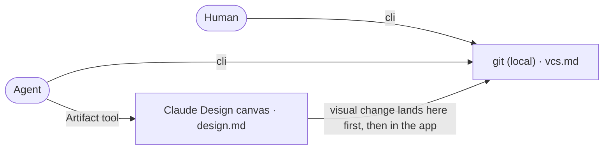

# Ecosystem

```mermaid
flowchart LR
  Human([Human])
  Agent([Agent])
  Git["git (local) · vcs.md"]
  Design["Claude Design canvas · design.md"]

  Human -- cli --> Git
  Agent -- cli --> Git
  Agent -- "Artifact tool" --> Design
  Design -- "visual change lands here first, then in the app" --> Git
```
